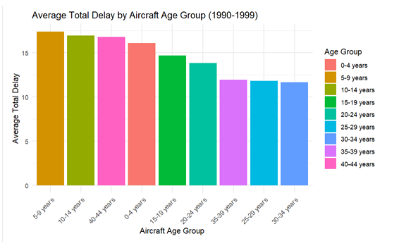
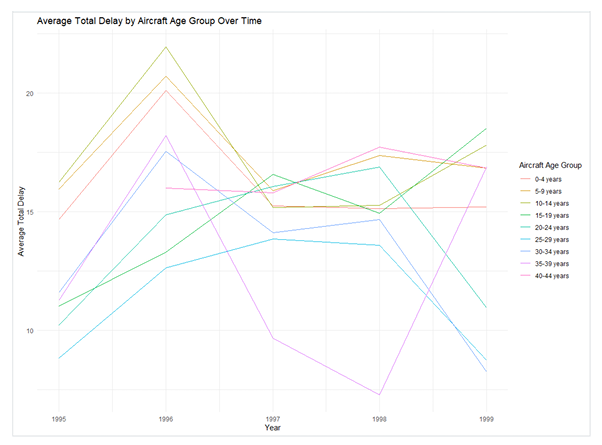
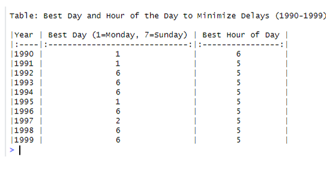
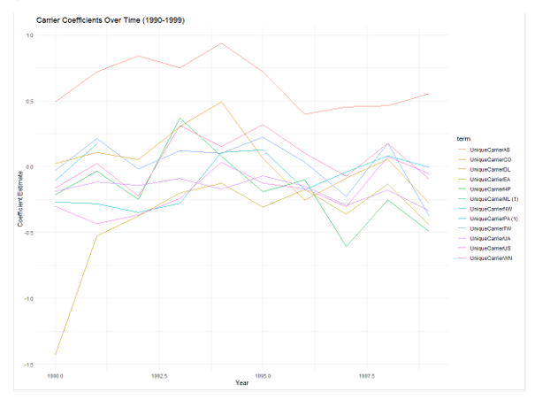
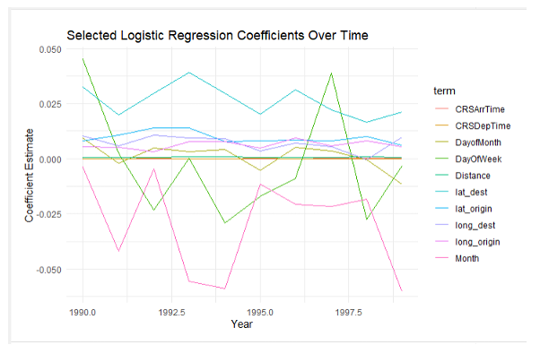
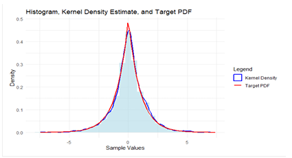
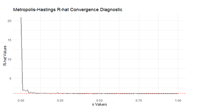

# ✈️ Flight Delay Prediction & Operational Optimization

**Logistic Regression, Bayesian Modeling, and Data-Driven Insights on U.S. Airline Delays (1990–1999)**

This project analyzes over a decade of U.S. domestic flight data to identify key factors contributing to delays and to develop a predictive logistic regression model. It combines classic machine learning, probabilistic sampling techniques, and statistical diagnostics to generate actionable insights for airline operations and scheduling optimization.

---

## 📌 Table of Contents
- [Project Goals](#🎯-project-goals)
- [Key Contributions](#🧠-key-contributions)
- [Technologies Used](#🛠-technologies-used)
- [Results Summary](#📊-results-summary)
- [Key Visual Insights](#📷-key-visual-insights)
- [File Structure](#📁-file-structure)
- [Final Reflections](#💼-final-reflections)

---

## 🎯 Project Goals

- Analyze U.S. flight delay data (1990–1999) to uncover factors contributing to delays.
- Build a robust **logistic regression** model to predict flight diversions.
- Generate operational insights (e.g. optimal departure time/day) to minimize delays.
- Apply advanced **Bayesian sampling** (Metropolis-Hastings, Gelman-Rubin diagnostics) to evaluate model convergence and reliability.

---

## 🧠 Key Contributions

- Cleaned and merged flight and aircraft metadata (50,000+ records).
- Engineered domain-specific features like **aircraft age** and **scheduled time segments**.
- Trained a logistic regression model, achieving up to **78% classification accuracy**.
- Conducted trend analysis of model coefficients over time for interpretability.
- Used **MCMC diagnostics** to validate parameter stability and model convergence.
- Created visual summaries to explain delay patterns by time, airline, and aircraft characteristics.

---

## 🛠 Technologies Used

| Category            | Tools/Techniques                                 |
|---------------------|--------------------------------------------------|
| Programming         | Python                                           |
| Libraries           | Pandas, NumPy, Matplotlib, Seaborn, Scikit-learn|
| Statistical Methods | Logistic Regression, Cross-Validation, ROC AUC  |
| Bayesian Modeling   | Metropolis-Hastings, R-hat Convergence, KDE     |
| IDE                 | Jupyter Notebook                                 |
| Visualization       | Line charts, bar plots, coefficient trends       |

---

## 📊 Results Summary

| Metric              | Result                                                  |
|---------------------|---------------------------------------------------------|
| Records Analyzed    | 50,000+                                                 |
| Model Used          | Logistic Regression                                     |
| Prediction Accuracy | 70–78%                                                  |
| Key Insight         | Aircraft age has **no strong correlation** with delay likelihood |
| Operational Insight | Best time to fly: **6 AM**, Best day: **Monday**       |

---

## 📷 Key Visual Insights

### Aircraft Age vs Delay  

### Delay Trends by Aircraft Age Over Time  

### Best Times to Fly (Summary Table)  

### Carrier-Specific Delay Coefficients  

### Logistic Regression Coefficients (1990–1999)  

### MCMC Diagnostic & KDE  
  

---

## 📁 File Structure

| File/Folder                               | Purpose                                             |
|-------------------------------------------|-----------------------------------------------------|
| `1_metropolis_hastings_sampling.ipynb`    | Custom implementation of MCMC sampling              |
| `2_mcmc_diagnostics_gelman_rubin.ipynb`   | Gelman-Rubin convergence diagnostic and KDE         |
| `3_data_setup_directory_structure.ipynb`  | Folder structure and initial data integration       |
| `4_airline_delay_data_ingestion.ipynb`    | Data loading, cleaning, and merging with metadata   |
| `5_feature_engineering_metadata_merge.ipynb` | Feature generation and exploration               |
| `/results/`                               | Contains charts and visual summaries                |
| `README.md`                               | Project overview and key insights                   |

---

## 💼 Final Reflections

This project demonstrates a complete pipeline from **raw data to operational insights**, integrating classical ML with Bayesian diagnostics and robust visualizations. I focused on clarity, interpretability, and real-world applicability — qualities critical for success in **data analytics roles** at financial institutions, tech companies, and consulting firms.

## 🔗 Author

**Ethan Choo**  
📍 Singapore | 🎓 Data Science & Business Analytics Graduate (SIM-UOL)  
🔗 [LinkedIn](https://www.linkedin.com/in/ethanchoo5/)  
